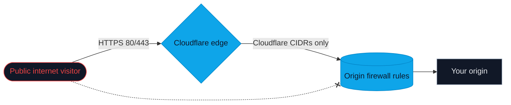

# Cloudflare Origin Lock (Linux nftables & Windows Firewall)

`cloudflare-origin-lock.sh` hardens Debian/Ubuntu with nftables, and `cloudflare-origin-lock.ps1` does the same on Windows Server with Windows Defender Firewall. Both only allow HTTP(S) traffic from Cloudflare's official IP ranges and provide safe apply/update/revert flows.

---

## Highlights

- Enforces that only Cloudflare edges can reach ports 80 and 443 while preserving SSH/WinRM access.
- Linux: transactional applies/updates with nftables syntax checks and rollback.
- Windows: creates paired allow/block rules in Windows Defender Firewall with mutex locking.
- Detects your SSH listening port on Linux so you can't accidentally lock yourself out.
- Stores state under `/var/lib/cloudflare-origin-lock` (Linux) or `C:\ProgramData\Cloudflare-Origin-Lock` (Windows).
- Supports unattended refreshes (cron/systemd timer on Linux; Task Scheduler on Windows) via the `update` action.

---

## Visual Overview

This flow shows what the scripts enforce when `apply` is run:



- The dashed red line illustrates that direct hits to the origin from the internet are blocked.
- The solid blue path shows traffic that keeps the Cloudflare proxy in front of the origin.

---


[](#)
[](#)
[](#)
[](#)
[](#)
[](#)

---

## Requirements

<details>
<summary>Linux (Debian/Ubuntu)</summary>

- `nftables` in use
- Root privileges (`sudo` or direct root shell)
- Tools: `curl`, `nft`, `systemctl`, `flock`, `awk`, `sed`, `wc`, `grep`
- Outbound HTTPS to `www.cloudflare.com` for IP lists
</details>

<details>
<summary>Windows Server</summary>

- Windows Defender Firewall available (`Get-NetFirewallRule`)
- Elevated PowerShell / Administrator shell
- Outbound HTTPS to `www.cloudflare.com`
</details>

---

## Files and Directories Touched

<details>
<summary>Linux paths</summary>

| Path | Purpose |
| ---- | ------- |
| `/etc/nftables.d/cloudflare-sets.nft` | Generated `cf_origin_lock` table and sets with Cloudflare IPs. |
| `/etc/nftables.conf` | Appends `include "/etc/nftables.d/*.nft"` if it is missing. |
| `/etc/nftables.d/cloudflare-sets.nft.prev.cf-lock` | Backup of the previous sets file for rollback. |
| `/etc/nftables.conf.prev.cf-lock` | Backup of the main nftables config before the include line is added. |
| `/var/lib/cloudflare-origin-lock/installed` | Timestamp marker indicating the script is applied. |
| `/var/lock/cloudflare-origin-lock.lck` | File lock to prevent concurrent runs. |

Backups are only created or restored when needed. Removing the script will not delete these files automatically.
</details>

<details>
<summary>Windows artifacts</summary>

- Marker: `C:\ProgramData\Cloudflare-Origin-Lock\installed.txt`
- Firewall rules (group "Cloudflare Origin Lock"):
  - `CF-Origin-Lock-Allow` (allow Cloudflare on TCP 80/443, override block rules)
  - `CF-Origin-Lock-Block` (block everyone else on TCP 80/443)
</details>

---

## Usage

### Quick One-Liners

<details>
<summary>Linux (Debian/Ubuntu, sudo/root)</summary>

```bash
curl -fsSL https://raw.githubusercontent.com/N0tMaggi/Cloudflare-Origin-Lock/main/cloudflare-origin-lock.sh | sudo bash -s -- apply
```

or

```bash
wget -qO- https://raw.githubusercontent.com/N0tMaggi/Cloudflare-Origin-Lock/main/cloudflare-origin-lock.sh | sudo bash -s -- apply
```

```bash
sudo ./cloudflare-origin-lock.sh <apply|update|revert|status>
```
</details>

<details>
<summary>Windows Server (elevated PowerShell)</summary>

```powershell
irm https://raw.githubusercontent.com/N0tMaggi/Cloudflare-Origin-Lock/main/cloudflare-origin-lock.ps1 -OutFile cloudflare-origin-lock.ps1; `
irm https://raw.githubusercontent.com/N0tMaggi/Cloudflare-Origin-Lock/main/cloudflare-origin-lock.bat -OutFile cloudflare-origin-lock.bat; `
.\cloudflare-origin-lock.bat apply
```

Then:

```powershell
.\cloudflare-origin-lock.bat update   # refresh Cloudflare IPs
.\cloudflare-origin-lock.bat status   # show state
.\cloudflare-origin-lock.bat revert   # remove rules
```
</details>

### Commands

<details>
<summary>Linux (nftables)</summary>

- `apply`: download Cloudflare IPv4/IPv6 ranges, render `cf_origin_lock` table/sets, add include to `/etc/nftables.conf` if missing, reload nftables transactionally, write marker.
- `update`: refresh IP ranges, replace sets file with rollback on reload failure.
- `revert`: restore backed-up configs or remove generated files, reload nftables, clear marker.
- `status`: show install time (marker) and first 100 lines of `nft list ruleset`.
- Interactive: run with no arguments to use a select menu for the same actions.
</details>

<details>
<summary>Windows (Windows Defender Firewall)</summary>

- `apply`: fetch Cloudflare IPv4/IPv6, create allow rule (`CF-Origin-Lock-Allow`, TCP 80/443, remote Cloudflare CIDRs, override block rules) and block rule (`CF-Origin-Lock-Block`, TCP 80/443, remote Any), write marker.
- `update`: re-run apply with fresh CIDRs (idempotent).
- `revert`: remove all rules in group "Cloudflare Origin Lock" and delete marker.
- `status`: show marker timestamp, report presence of allow/block rules and first 10 remote addresses in the allow rule.
</details>

---

## Safety Features

- **Idempotent detection** - rerunning `apply` is safe; if the include line already exists it will not be duplicated (Linux).
- **nftables syntax validation** - rules are compiled with `nft -c` before being installed (Linux).
- **SSH guardrails** - if your SSH port is 80 or 443, the script aborts to avoid self-lockout (Linux).
- **File locking** - `flock` prevents simultaneous executions that could corrupt state (Linux).
- **Transactional backups** - previous configuration files are kept until the new rules are successfully loaded (Linux).
- **Firewall mutex** - global named mutex prevents concurrent runs (Windows).

---

## Customization

- **Allowed application ports**: At the top of the script, `define CF_PORTS = { 80, 443 }`. Modify and rerun `apply` if you expose additional HTTPS-based services on alternative ports.
- **SSH detection**: The script reads `/etc/ssh/sshd_config` for the last declared `Port`. If you manage SSH elsewhere (e.g., via `sshd_config.d`), confirm detection with `./cloudflare-origin-lock.sh status`.
- **State paths**: Adjust `SETS_FILE`, `NFT_MAIN`, or `STATE_DIR` variables in the script if your distribution uses customized locations.

Whenever you edit the script, rerun `apply` so the nftables configuration syncs with your changes.

---

## Automating Updates

Because Cloudflare ranges change periodically, schedule the `update` action. Example systemd timer:

```ini
# /etc/systemd/system/cloudflare-origin-lock-update.service
[Unit]
Description=Refresh Cloudflare origin allow-list

[Service]
Type=oneshot
ExecStart=/usr/local/bin/cloudflare-origin-lock.sh update

# /etc/systemd/system/cloudflare-origin-lock-update.timer
[Unit]
Description=Run Cloudflare origin update daily

[Timer]
OnCalendar=daily
Persistent=true

[Install]
WantedBy=timers.target
```

Enable with:

```bash
sudo systemctl daemon-reload
sudo systemctl enable --now cloudflare-origin-lock-update.timer
```

Windows: create a scheduled task that runs `cloudflare-origin-lock.bat update` daily with highest privileges.

---

## Troubleshooting

- **`Missing commands: ...`** – install the listed packages (`apt install curl nftables gawk sed grep coreutils`).
- **`nftables reload failed`** – inspect `journalctl -u nftables` for syntax errors, then fix and rerun `apply`.
- **No traffic reaches your origin** – confirm the Cloudflare proxy is enabled (orange cloud) and `status` shows the `cf_origin_lock` chain.
- **Need to allow additional IPs** – add them manually to `/etc/nftables.d/cloudflare-sets.nft` under the appropriate set and reload nftables, or maintain a companion include file.

If everything appears correct but traffic still fails, run `sudo nft list ruleset | less` to inspect the active policy and confirm the `cf_origin_lock` chain is attached.

---

## Removal

**Linux**
1. Run `sudo ./cloudflare-origin-lock.sh revert`.
2. Delete the generated files if desired:
   ```bash
   sudo rm -f /etc/nftables.d/cloudflare-sets.nft
   sudo rm -f /etc/nftables.conf.prev.cf-lock /etc/nftables.d/cloudflare-sets.nft.prev.cf-lock
   sudo rm -rf /var/lib/cloudflare-origin-lock
   ```
3. Optionally remove the script itself.

**Windows**
1. Run `.\cloudflare-origin-lock.bat revert` in an elevated shell.
2. Optionally delete `cloudflare-origin-lock.ps1`, `cloudflare-origin-lock.bat`, and `C:\ProgramData\Cloudflare-Origin-Lock`.

---

## License

No explicit license is provided. Treat this script as internal infrastructure code unless you add a license header.
